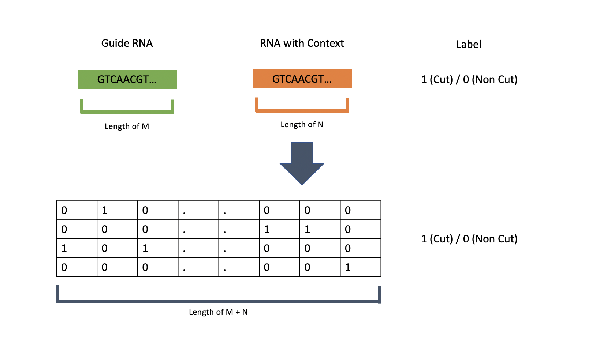

# CRISPR-TTN
CRISPR-TTN: Metric learning based of two tower network model for predicting CRISPRcas9 - RNA cut and non cut.

This repository contains CNN-based two tower network named CRISPR-TTN for predicting cut or non cut on RNA sequence by CRISPRcas9 guide RNA. This project is a new approach on facing the CRISPR off-target issue and was inspired by [crispr2vec](https://www.biorxiv.org/content/10.1101/2020.10.28.359885v2).

The crispr2vec approach predicted cut and non-cut using metric learning, utilizing siamese network. While the siamese network is great at distinguishing classes, we found it is not entirely suitable for the case. We believe that the target gRNA and off-target sequence are not coming from the same distribution, hence these sequences require separate processing. Furthermore we want to add additional context for RNA sequence, resulted in different size of input for gRNA and RNA pair which make Siamese Network impossible to use. Two Tower Network is a metric distance based model similar to the Siamese Network but it has two different embedding layers for each pair of inputs, they don’t share the same architecture and weight hence we think it would be well-suited for our problem. It has been used by Tensorflow as their base [recommendation system](https://blog.tensorflow.org/2020/09/introducing-tensorflow-recommenders.html) model. 

In normal classification, each class embedding is expected to be as distant as possible and vice versa for the same class. Yet in our case, we only want the cut pair embedding to be as close as possible, while the non-cut pair to be as distant as possible. We cannot define the relationship between pairs coming from different gRNA. This is also the reason why we change the form of our dataset. 
Given our unique use case, here we implement our own custom triplet loss function that is suitable to our needs. The difficulty is how we choose the pair and how we represent one row dataset being fed to the model. For a triplet loss, we need to generate a pair of positive and negative samples from each batch in order to calculate the triplet loss

Due to this case-specific constraint we created our own custom Tensorflow-based Triplet Loss Function and Metric Class for this model.

## How to install
### Prerequisite
- Linux OS
- Python 3.8.8

### Install Python libraries
`pip3 install -r requirements.txt`

### Usage
#### Data preparation
Prepare the input file, preferably in CSV format. For training prepare a 3-columns data of RNA sequence, gRNA sequence, and label (1=cut, 0=non cut). For inference, the format is the same, just remove the label column data. Below is a little explanation on how we preprocess the data before feeding it to the model.

#### Training
Run `python3 train.py [input_path] [output_model_path]`

#### Predict / Inference
Run `python3 predict.py [input_path] [model_path] [output_path]`

### TBD
- predict.py
- Weighted loss on additional feature 'read'
- Optimize pair generation